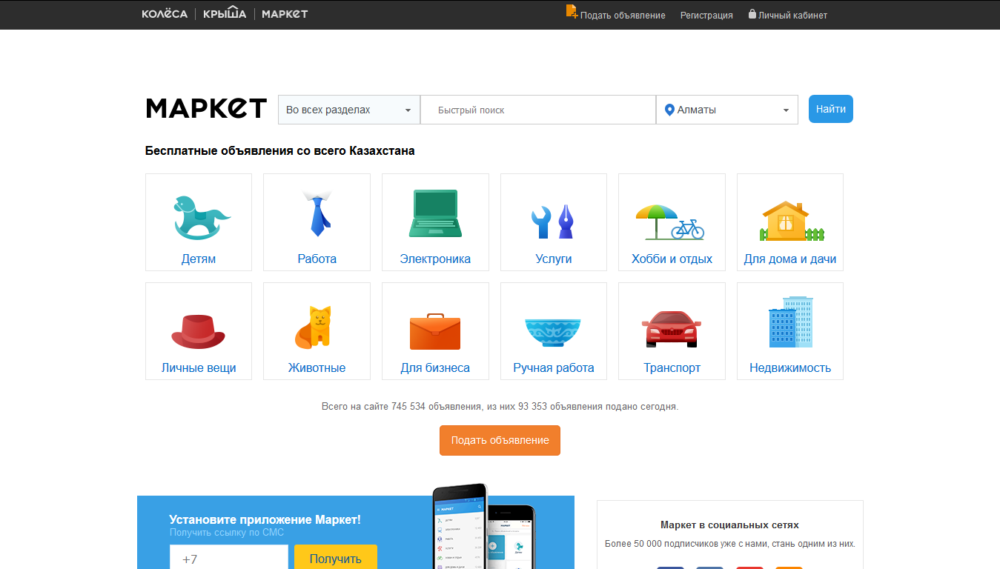
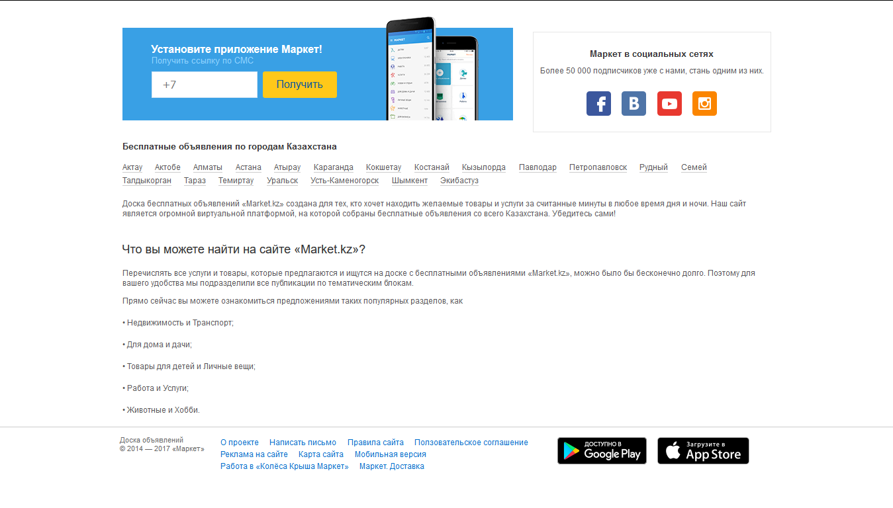
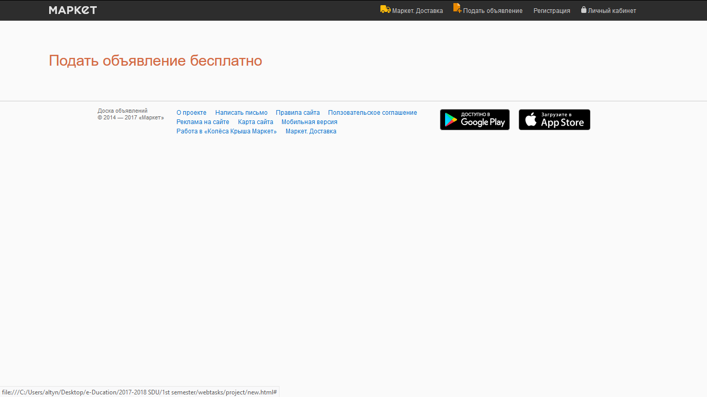
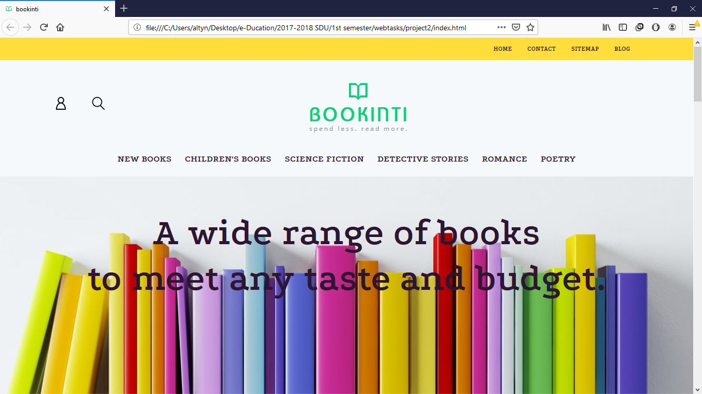
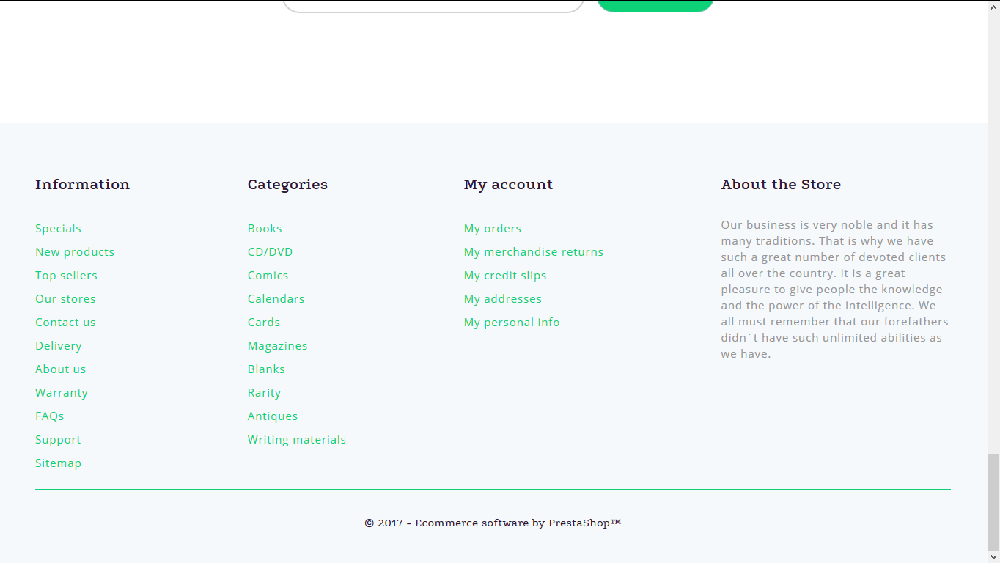
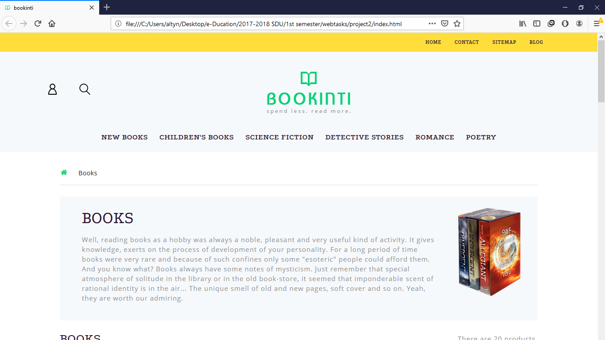
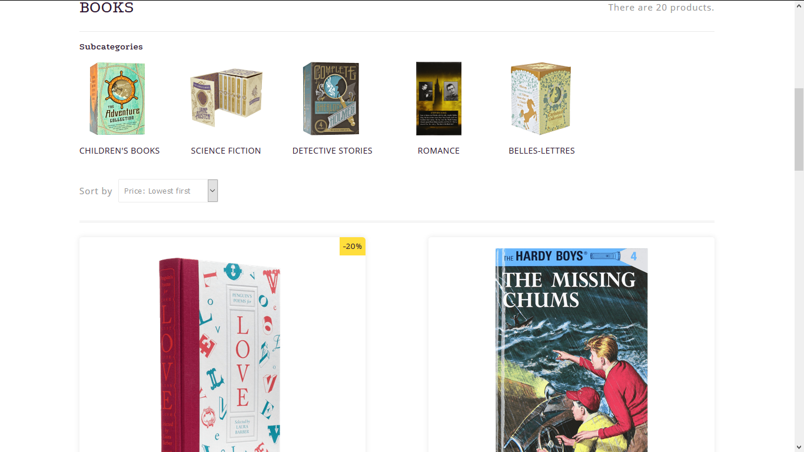
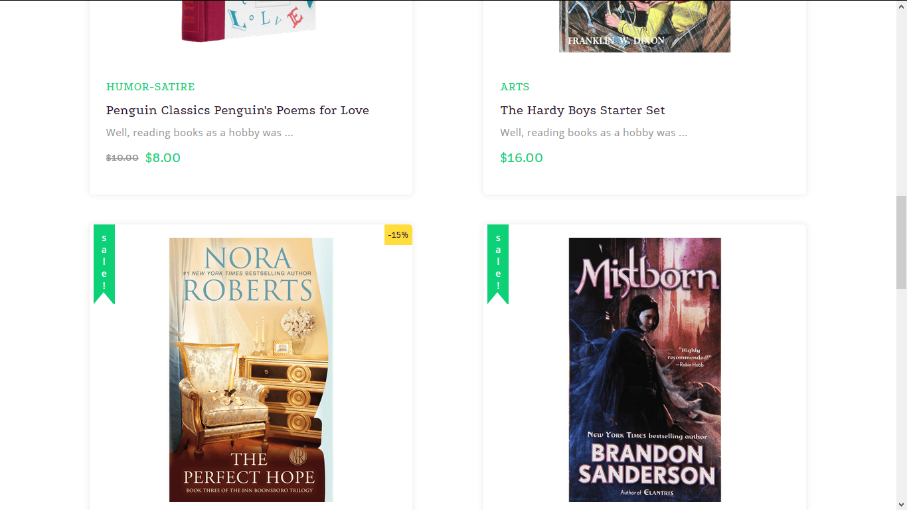
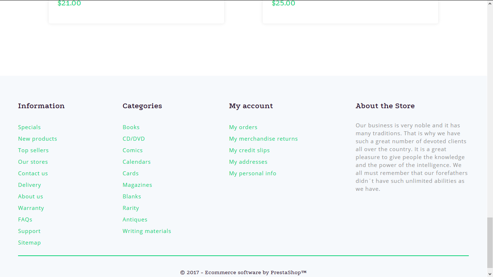

# About repository
This repository is for projects that were done in course of web programming.

# About projects
The project requirements are shown <a href="https://docs.google.com/document/d/1vJ--Gceq2_RQ1fbvN5X4k165-x6yW92-BPlnJi-1py4/edit">here</a>.
There is shown below the images of the first project.

There is shown below the images of the second project.

